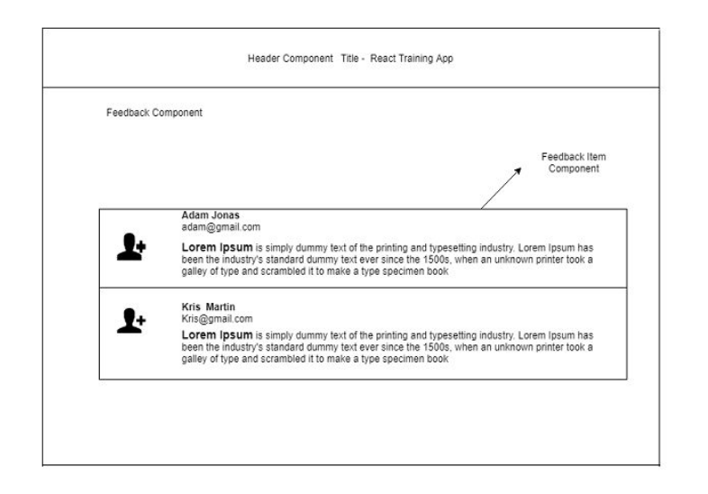

# React JS Assignment 2
- Create a header component which shows the title of the training program
- Create a feedback listing component which shows the list of users feedback. Use one feedback item component and reuse it for each feedback. 
- Please follow this [link](https://anotepad.com/notes/bkg3wq) to have sample data for the feedback component.

