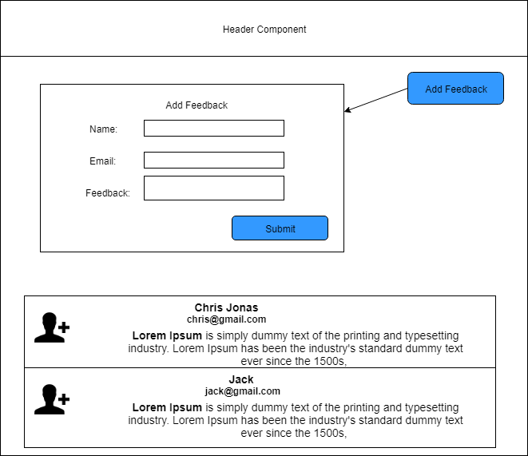

# React JS Assignment 3
- Add new button to the feedback component, clicking on which will show an Add feedback f     form.  
- Add validation to the Name and feedback fields 
- On clicking the submit button on the form, the newly added feedback will be added to the   feedback list.
- On submitting, the add form should disappear.

