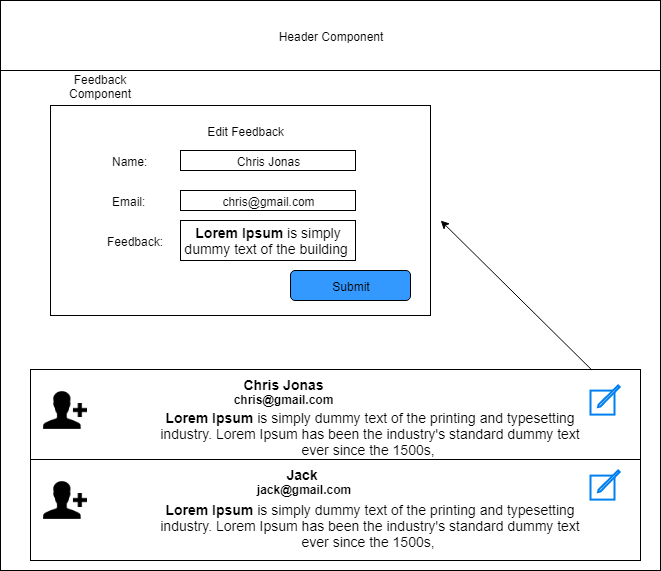

# React JS Assignment 3
- Add an edit button to the feedback, on clicking it will allow users to edit the feedback,
  Use the same add feedback component to edit the feedback
- Populate the current data in the form and after updating the form , the updated changes  should be shown on the feedback list.

